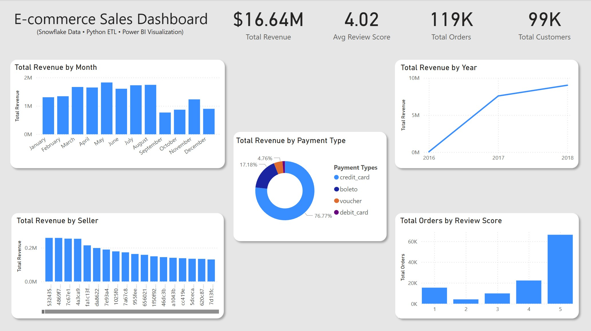

# E-commerce Sales Analytics Dashboard

This project is an end-to-end business intelligence solution analyzing Brazilian e-commerce sales using Snowflake, Python (Pandas), SQL, and Power BI.

## Tools Used

- **Python & Pandas**: Data cleaning, inspection, and transformation
- **Snowflake**: Cloud data warehousing & SQL querying
- **Power BI**: Interactive dashboard design
- **SQL**: Used for joins, summarization, and view creation

## Dashboard Features

- Total revenue, orders, customers, and review score KPIs
- Monthly and yearly sales trends
- Payment method breakdown
- Customer feedback distribution (review scores)

## Project Structure

| Folder              | Description                                          |
| ------------------- | ---------------------------------------------------- |
| `Original Data/`    | Original datasets (CSV format)                       |
| `Cleaned Data/`     | Cleaned datasets (CSV format)                        |
| `SQL Queries/`      | All SQL scripts for Snowflake (view creation, joins) |
| `Jupyter Notebook/` | Jupyter Notebook for preprocessing with Python       |
| `Power BI/`         | `.pbix` file with final Power BI dashboard           |
| `Images/`           | Screenshots and visuals                              |

## How to Use

1. Clone the repo
2. Load cleaned CSVs into Snowflake or your SQL tool of choice
3. Run queries in `/sql` folder
4. Open Power BI and load the `.pbix` file

## Sample SQL Queries

See `sample_queries.sql` for insights like:

- Revenue by product
- Orders by review score
- Revenue by year/month

---

## Author

Created by Ein Cagle — Data Analyst & BI Developer  
Visit: [Portfolio](https://www.datascienceportfol.io/eincagle)
